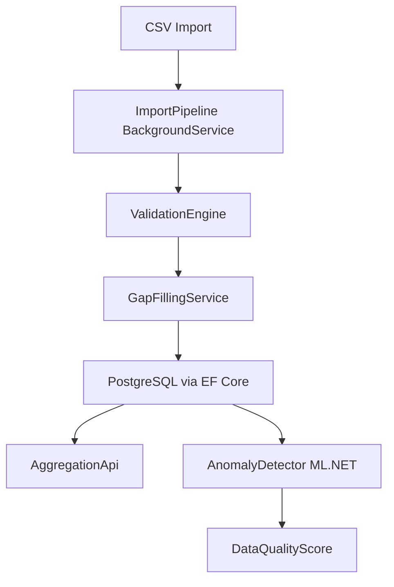

# meter-data-service

> ASP.NET Core Web API for meter data management, gap filling, and anomaly detection in the German energy market.


---

## Problem

In the liberalized German energy market, metering point operators (Messstellenbetreiber) must collect, validate, and forward 15-minute interval meter readings (Zählerstände / Lastgangdaten) for every market location (Marktlokation). Real-world data is imperfect: sensors miss intervals during daylight saving transitions, communication failures create gaps, and faulty hardware produces spikes.

This service models the full meter data lifecycle: ingesting raw CSV readings, validating each value against plausibility rules, applying gap-filling algorithms (Ersatzwertbildung) with full traceability, and exposing aggregated consumption via a clean REST API.

A background anomaly-detection pipeline (ML.NET) continuously flags suspicious patterns — giving grid operators an early warning before a gap becomes a billing dispute.

---

## Features

- Model: `MeterLocation` (Messlokation), `MarketLocation` (Marktlokation), `Meter`, `MeasurementSeries`, 15-minute intervals
- Synthetic data generator: H0 household profile, commercial profile, PV feed-in profile, with injected gaps and outliers
- Import pipeline: CSV → validation (negative values, spikes, missing intervals, DST days) → per-value status (`Measured`, `Estimated`, `Replaced`)
- Gap filling (Ersatzwertbildung): linear interpolation for short gaps, similar-day method for long gaps — every replacement is traceable
- Aggregation API: hourly, daily, monthly totals per market location
- Anomaly detection: ML.NET spike and change-point detection with an explainable data-quality score per series
- Background ingestion via `Channel<T>` and `BackgroundService`
- OpenTelemetry metrics for import throughput

---

## Innovation

_TODO: expand after implementation_

---

## Architecture



_See `docs/architecture.md` for detailed component descriptions._

---

## Quick Start

```bash
docker compose up -d
dotnet run --project src/MeterDataService.Api
```

Example request:

```bash
curl http://localhost:5000/api/market-locations/{malo}/consumption?from=2024-01-01&to=2024-01-31&granularity=daily
```

See `docs/requests.http` for a full set of example requests.

---

## Domain Glossary

| German | English | Explanation |
|--------|---------|-------------|
| Marktlokation (MaLo) | Market location | The billing point for energy delivery; identified by a 33-digit ID |
| Messlokation (MeLo) | Meter location | The physical measurement point; one MeLo can feed multiple MaLos |
| Zählerstand | Meter reading | Cumulative counter value at a point in time |
| Lastgang | Load profile | Time-series of interval (15-min) consumption values |
| Ersatzwertbildung | Gap filling | Substituting missing or invalid readings with estimated values |
| Messstellenbetreiber (MSB) | Metering point operator | Responsible for meter hardware and data delivery |
| Standardlastprofil (SLP) | Standard load profile | Synthetic daily shape (H0 = household, G0 = general commerce) |

---

## Testing

```bash
dotnet test
```

Coverage highlights:
- DST transition correctness: 23-hour and 25-hour days
- Rounding: `decimal` arithmetic, no floating-point for energy quantities
- Gap filling: identical results regardless of input ordering
- Anomaly detection: known spike sequences always flagged

---

## Design Decisions

See `docs/adr/` for Architecture Decision Records.

---

## Roadmap / Next Steps

- MSCONS import from `edifact-energy-parser` (cross-project)
- BenchmarkDotNet import speed benchmarks
- Prometheus/Grafana dashboard for the OpenTelemetry metrics

---

## Kurzfassung auf Deutsch

Dieser Dienst implementiert die Kernfunktionen eines Messdatenmanagement-Systems (MDM) für den deutschen Energiemarkt. Rohdaten aus 15-Minuten-Intervallzählungen werden über eine CSV-Importpipeline eingelesen, gegen Plausibilitätsregeln geprüft und mit Statusinformationen (gemessen, geschätzt, ersetzt) versehen. Fehlende Werte werden durch Ersatzwertbildung aufgefüllt — kurze Lücken durch lineare Interpolation, längere durch das Ähnlichtagsverfahren. Jede Ersetzung ist vollständig rückverfolgbar. Eine ML.NET-basierte Anomalieerkennung überwacht die Lastgänge kontinuierlich im Hintergrund und berechnet einen datenqualitätsbezogenen Score je Messreihe. Die REST-API liefert aggregierte Verbrauchswerte (stündlich, täglich, monatlich) pro Marktlokation. Zeitzonenkorrektheit für die Mitteleuropäische Zeitzone (MEZ/MESZ) — insbesondere die 23- und 25-Stunden-Tage — wird durch dedizierte Tests abgesichert.
