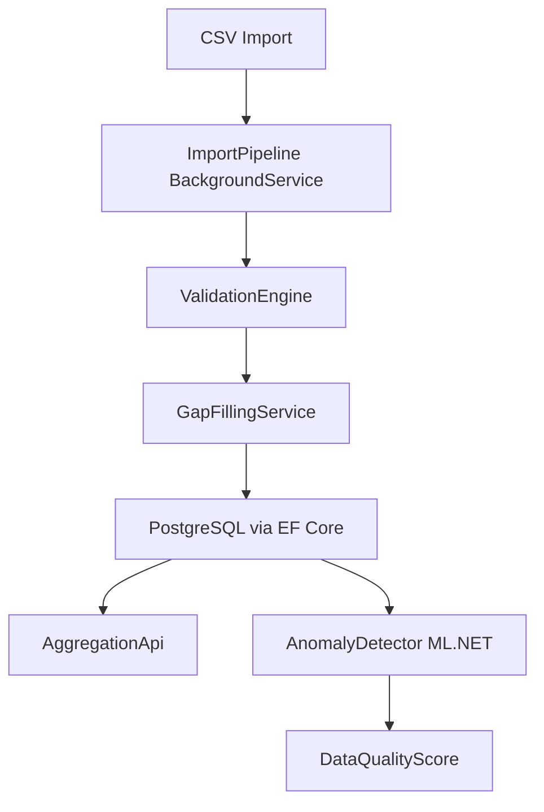
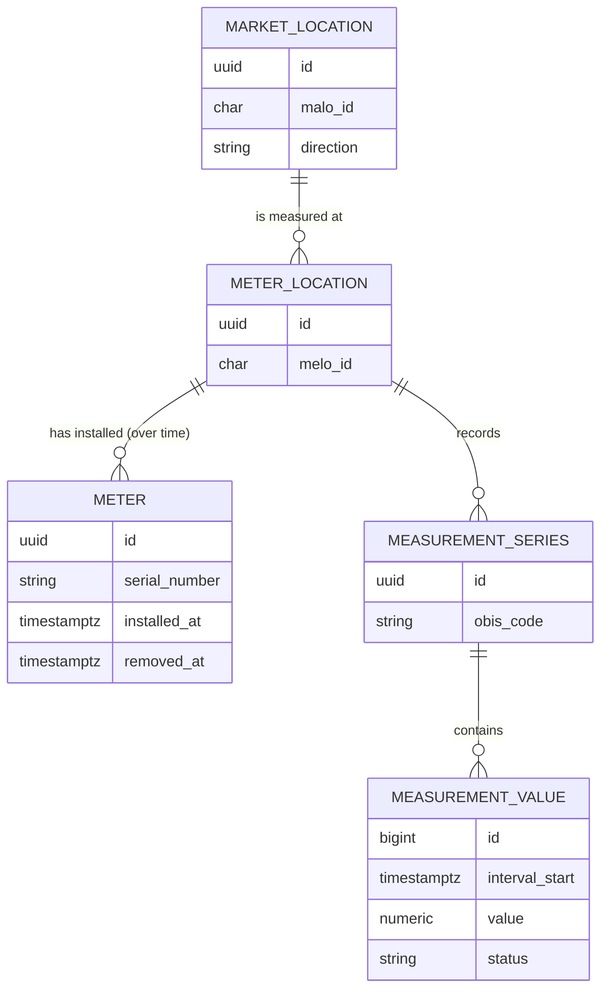

# meter-data-service

> ASP.NET Core Web API for meter data management, gap filling, and anomaly detection in the German energy market.


---

## Problem

In the liberalized German energy market, metering point operators (Messstellenbetreiber) must collect, validate, and forward 15-minute interval meter readings (Zählerstände / Lastgangdaten) for every market location (Marktlokation). Real-world data is imperfect: sensors miss intervals during daylight saving transitions, communication failures create gaps, and faulty hardware produces spikes.

This service models the full meter data lifecycle: ingesting raw CSV readings, validating each value against plausibility rules, applying gap-filling algorithms (Ersatzwertbildung) with full traceability, and exposing aggregated consumption via a clean REST API.

A background anomaly-detection pipeline (ML.NET) continuously flags suspicious patterns — giving grid operators an early warning before a gap becomes a billing dispute.

---

## Features

- Model: `MeterLocation` (Messlokation), `MarketLocation` (Marktlokation), `Meter`, `MeasurementSeries`, 15-minute intervals
- Synthetic data generator: H0 household profile, commercial profile, PV feed-in profile, with injected gaps and outliers
- Import pipeline: CSV → validation (negative values, spikes, missing intervals, DST days) → per-value status (`Measured`, `Estimated`, `Replaced`)
- Gap filling (Ersatzwertbildung): linear interpolation for short gaps, similar-day method for long gaps — every replacement is traceable
- Aggregation API: hourly, daily, monthly totals per market location
- Anomaly detection: ML.NET spike and change-point detection with an explainable data-quality score per series
- Background ingestion via `Channel<T>` and `BackgroundService`
- OpenTelemetry metrics for import throughput

---

## Innovation

_TODO: expand after implementation_

---

## Architecture



### Data model



Domain entities live in `MeterDataService.Domain` and guard their own invariants (valid MaLo/MeLo IDs with check digit, one installed meter per meter location, 15-minute aligned UTC interval starts, at most 5 decimal places). `MeterDataService.Infrastructure` maps them to PostgreSQL with EF Core: energy values as `numeric(18,5)`, timestamps as `timestamptz`, and a unique index on `(measurement_series_id, interval_start)`.

### Synthetic data

`SyntheticProfileGenerator` (`MeterDataService.Application`) produces realistic 15-minute series for any range of German calendar days:

- **Household (H0)**: hourly weekday/Saturday/Sunday shapes plus the H0 dynamization polynomial (more load in winter), scaled to a given annual consumption.
- **Commercial**: a flat base load (Bandlast) with ±5 % noise.
- **PV feed-in**: a sine-shaped day around solar noon in UTC, so production doesn't jump by an hour at the DST switch. Day length and peak height follow the season, and a random cloud factor applies per day.

Defects arrive the way they do from the field: gaps are missing intervals (default 0.5 %), spikes are values multiplied by 4–8× that still carry status `Measured` (default 0.2 %). With a fixed `Seed`, a series can be reproduced exactly, and changing a probability doesn't change the undisturbed values.

### CSV import and validation

`CsvImportParser` (CsvHelper) reads files with the columns `timestamp`, `value` (kWh) and `status`:

```csv
timestamp;value;status
2026-10-25T02:00:00+02:00;0,412;Measured
2026-10-25T02:00:00+01:00;0,398;Measured
2026-10-25 03:00;0.405;Estimated
```

- Comma or semicolon separator, decimal point or decimal comma, any column order, case-insensitive header and status.
- Timestamps are the interval start in ISO 8601. With an offset (or `Z`) they are unambiguous. Without one they are German local time: the repeated 02:00 hour on the fall-back day is assigned by order (first summer time, then winter time), and local times skipped in spring are errors.
- A malformed row (bad timestamp, not on a quarter hour, more than 5 decimals, unknown status) becomes an error with its line number. The rest of the file is still read.

`ValidationEngine` then checks the readings over a period of German calendar days. It never changes a value. Every reading gets a `ValidationResult` (`Ok`, `Warning`, `Rejected`) with the rule and a plain-language reason:

| Rule | Level | Outcome |
|------|-------|---------|
| Negative value | value | Rejected |
| Spike: value > 3× the median of the surrounding hour (±2 intervals) | value | Rejected |
| Duplicate interval (first value is kept) / outside the period | value | Rejected |
| Missing intervals: every absent interval is listed, one finding per contiguous gap | period | Warning |
| DST day with an interval count other than 92 / 100, e.g. a sender that ignored the clock change | period | Warning |

The spike check uses the median of the neighbours, so one outlier can't hide another next to it. It is skipped when the median is zero (PV at night), because a ratio to zero means nothing.

---

## Quick Start

```bash
docker compose up -d
dotnet tool restore
dotnet dotnet-ef database update --project src/MeterDataService.Infrastructure --startup-project src/MeterDataService.Api
dotnet run --project src/MeterDataService.Api
```

The development connection string (`ConnectionStrings:MeterData` in `appsettings.Development.json`) matches the credentials in `docker-compose.yml`.

Example request:

```bash
curl http://localhost:5000/api/market-locations/{malo}/consumption?from=2024-01-01&to=2024-01-31&granularity=daily
```

See `docs/requests.http` for a full set of example requests.

---

## Domain Glossary

| German | English | Explanation |
|--------|---------|-------------|
| Marktlokation (MaLo) | Market location | The billing point for energy delivery; identified by an 11-digit ID with check digit |
| Messlokation (MeLo) | Meter location | The physical measurement point; identified by a 33-character ID starting with the country code |
| Zähler | Meter | The physical device; replaced over time (Zählerwechsel) while the meter location stays |
| Zählerstand | Meter reading | Cumulative counter value at a point in time |
| OBIS-Kennzahl | OBIS code | Identifies the measured quantity, e.g. `1-1:1.29.0` for consumed energy per interval |
| Messwertstatus | Measurement status | Whether a value is measured, estimated or replaced (`Measured`, `Estimated`, `Replaced`) |
| Einspeisung / Ausspeisung | Generation / consumption | Energy direction of a market location |
| Lastgang | Load profile | Time-series of interval (15-min) consumption values |
| Ersatzwertbildung | Gap filling | Substituting missing or invalid readings with estimated values |
| Messstellenbetreiber (MSB) | Metering point operator | Responsible for meter hardware and data delivery |
| Standardlastprofil (SLP) | Standard load profile | Synthetic daily shape (H0 = household, G0 = general commerce) |
| Dynamisierung | Dynamization | Seasonal scaling of the H0 profile by day of year (more load in winter) |
| Bandlast | Base load | Constant load over the whole day |
| Plausibilisierung | Validation | Checking delivered values against plausibility rules before they are used |
| Zeitumstellung | Clock change | Switch to/from summer time; makes a market day 23 or 25 hours long |

---

## Testing

```bash
dotnet test                                  # unit + integration tests
dotnet test --filter Category=Integration    # only the PostgreSQL integration tests
```

Integration tests use [Testcontainers](https://dotnet.testcontainers.org/). They need a running Docker engine and no other setup: no `docker compose up`, no connection string. Each test class gets its own `postgres:17` container, and the real EF Core migrations are applied to it (`IntegrationTestBase` + `PostgreSqlFixture`). If Docker isn't available, the integration tests are **skipped** locally. With the `CI` environment variable set (GitHub Actions sets it), they **fail**, so a broken pipeline can't pass silently.

Coverage highlights:
- Domain invariants: MaLo check digit, MeLo format, meter exchange rules, 15-minute alignment
- Persistence model: column types (`numeric(18,5)`, `timestamptz`), unique keys, migrations in sync with the model — checked without a database
- Against real PostgreSQL: migrations apply to an empty database; a `MeasurementValue` round-trips with all 5 decimals and a UTC timestamp; the repeated local 02:00 hour on the fall-back day is stored as two distinct intervals
- DST transition correctness: 23-hour and 25-hour days. The synthetic generator yields 96 / 92 / 100 intervals for a normal / spring-forward / fall-back day for all three profiles.
- Synthetic profiles: H0 annual energy matches the requested consumption, PV is zero at night and stays centred on solar noon across the clock change, gap and spike rates match the configured probabilities
- CSV import: offset and local timestamps, the repeated hour on the fall-back day (100 rows → 100 distinct UTC intervals), skipped spring local times, per-line errors, semicolon + decimal comma
- Validation: all rule types (negative, spike, duplicate, outside period, missing intervals, DST interval count). A known spike in a CSV is rejected, a gap gives the exact missing-interval count, a 96-row fall-back day is flagged. Every spike injected by the synthetic generator is rejected, with no false positives on clean household, commercial and PV series (incl. sunrise ramps).
- Rounding: `decimal` arithmetic, no floating-point for energy quantities
- Gap filling: identical results regardless of input ordering
- Anomaly detection: known spike sequences always flagged

---

## Design Decisions

See `docs/adr/` for Architecture Decision Records.

- [ADR 0001 — Persistence model for interval meter data](docs/adr/0001-persistence-model-for-interval-data.md): `decimal(18,5)`, UTC `timestamptz`, UUIDv7 keys, 1:n MaLo–MeLo simplification

---

## Roadmap / Next Steps

- MSCONS import from `edifact-energy-parser` (cross-project)
- BenchmarkDotNet import speed benchmarks
- Prometheus/Grafana dashboard for the OpenTelemetry metrics

---

## Kurzfassung auf Deutsch

Dieser Dienst implementiert die Kernfunktionen eines Messdatenmanagement-Systems (MDM) für den deutschen Energiemarkt. Rohdaten aus 15-Minuten-Intervallzählungen werden über eine CSV-Importpipeline eingelesen, gegen Plausibilitätsregeln geprüft und mit Statusinformationen (gemessen, geschätzt, ersetzt) versehen. Fehlende Werte werden durch Ersatzwertbildung aufgefüllt — kurze Lücken durch lineare Interpolation, längere durch das Ähnlichtagsverfahren. Jede Ersetzung ist vollständig rückverfolgbar. Eine ML.NET-basierte Anomalieerkennung überwacht die Lastgänge kontinuierlich im Hintergrund und berechnet einen datenqualitätsbezogenen Score je Messreihe. Die REST-API liefert aggregierte Verbrauchswerte (stündlich, täglich, monatlich) pro Marktlokation. Zeitzonenkorrektheit für die Mitteleuropäische Zeitzone (MEZ/MESZ) — insbesondere die 23- und 25-Stunden-Tage — wird durch dedizierte Tests abgesichert.
