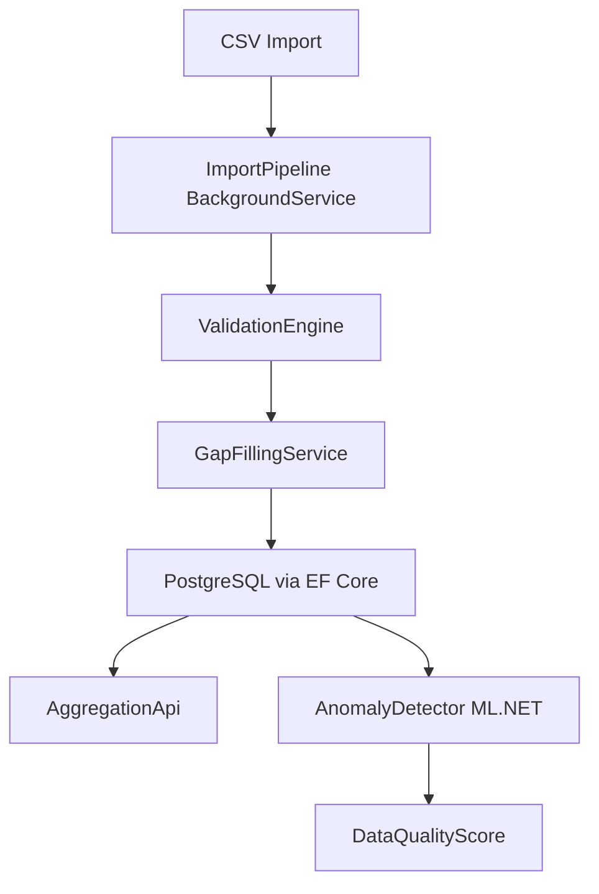
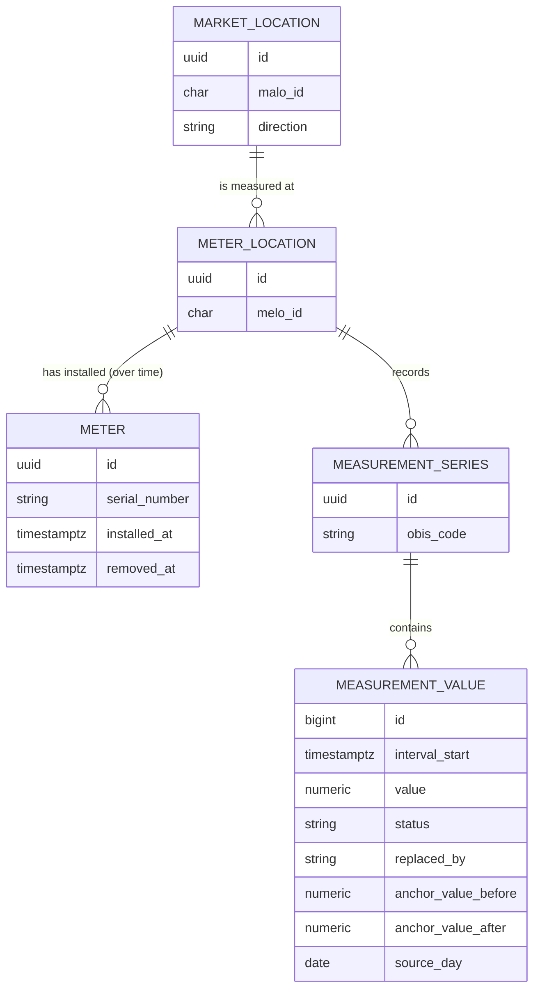
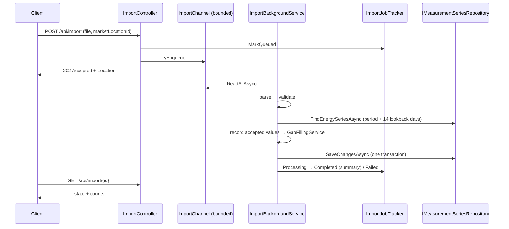

# meter-data-service

> ASP.NET Core Web API for meter data management, gap filling, and anomaly detection in the German energy market.


---

## Problem

In the liberalized German energy market, metering point operators (Messstellenbetreiber) must collect, validate, and forward 15-minute interval meter readings (Zählerstände / Lastgangdaten) for every market location (Marktlokation). Real-world data is imperfect: sensors miss intervals during daylight saving transitions, communication failures create gaps, and faulty hardware produces spikes.

This service models the full meter data lifecycle: ingesting raw CSV readings, validating each value against plausibility rules, applying gap-filling algorithms (Ersatzwertbildung) with full traceability, and exposing aggregated consumption via a clean REST API.

A background anomaly-detection pipeline (ML.NET) continuously flags suspicious patterns — giving grid operators an early warning before a gap becomes a billing dispute.

---

## Features

- Model: `MeterLocation` (Messlokation), `MarketLocation` (Marktlokation), `Meter`, `MeasurementSeries`, 15-minute intervals
- Synthetic data generator: H0 household profile, commercial profile, PV feed-in profile, with injected gaps and outliers
- Import pipeline: CSV → validation (negative values, spikes, missing intervals, DST days) → per-value status (`Measured`, `Estimated`, `Replaced`)
- Gap filling (Ersatzwertbildung): linear interpolation for short gaps, similar-day method for long gaps — every replacement is traceable
- Aggregation API: hourly, daily, monthly totals per market location
- Anomaly detection: ML.NET spike and change-point detection with an explainable data-quality score per series
- Background ingestion via `Channel<T>` and `BackgroundService`
- OpenTelemetry metrics for import throughput

---

## Innovation

_TODO: expand after implementation_

---

## Architecture



### Data model



Domain entities live in `MeterDataService.Domain` and guard their own invariants (valid MaLo/MeLo IDs with check digit, one installed meter per meter location, 15-minute aligned UTC interval starts, at most 5 decimal places). `MeterDataService.Infrastructure` maps them to PostgreSQL with EF Core: energy values as `numeric(18,5)`, timestamps as `timestamptz`, and a unique index on `(measurement_series_id, interval_start)`.

### Synthetic data

`SyntheticProfileGenerator` (`MeterDataService.Application`) produces realistic 15-minute series for any range of German calendar days:

- **Household (H0)**: hourly weekday/Saturday/Sunday shapes plus the H0 dynamization polynomial (more load in winter), scaled to a given annual consumption.
- **Commercial**: a flat base load (Bandlast) with ±5 % noise.
- **PV feed-in**: a sine-shaped day around solar noon in UTC, so production doesn't jump by an hour at the DST switch. Day length and peak height follow the season, and a random cloud factor applies per day.

Defects arrive the way they do from the field: gaps are missing intervals (default 0.5 %), spikes are values multiplied by 4–8× that still carry status `Measured` (default 0.2 %). With a fixed `Seed`, a series can be reproduced exactly, and changing a probability doesn't change the undisturbed values.

### CSV import and validation

`CsvImportParser` (CsvHelper) reads files with the columns `timestamp`, `value` (kWh) and `status`:

```csv
timestamp;value;status
2026-10-25T02:00:00+02:00;0,412;Measured
2026-10-25T02:00:00+01:00;0,398;Measured
2026-10-25 03:00;0.405;Estimated
```

- Comma or semicolon separator, decimal point or decimal comma, any column order, case-insensitive header and status.
- Timestamps are the interval start in ISO 8601. With an offset (or `Z`) they are unambiguous. Without one they are German local time: the repeated 02:00 hour on the fall-back day is assigned by order (first summer time, then winter time), and local times skipped in spring are errors.
- A malformed row (bad timestamp, not on a quarter hour, more than 5 decimals, unknown status) becomes an error with its line number. The rest of the file is still read.

`ValidationEngine` then checks the readings over a period of German calendar days. It never changes a value. Every reading gets a `ValidationResult` (`Ok`, `Warning`, `Rejected`) with the rule and a plain-language reason:

| Rule | Level | Outcome |
|------|-------|---------|
| Negative value | value | Rejected |
| Spike: value > 3× the median of the surrounding hour (±2 intervals) | value | Rejected |
| Duplicate interval (first value is kept) / outside the period | value | Rejected |
| Missing intervals: every absent interval is listed, one finding per contiguous gap | period | Warning |
| DST day with an interval count other than 92 / 100, e.g. a sender that ignored the clock change | period | Warning |

The spike check uses the median of the neighbours, so one outlier can't hide another next to it. It is skipped when the median is zero (PV at night), because a ratio to zero means nothing.

### Background import



- The upload endpoint only checks the request (file present and non-empty, valid MaLo-ID with check digit, max 10 MB), reads the file, and queues an `ImportJob`. It never parses on the request thread.
- `ImportChannel` wraps a **bounded** `Channel<ImportJob>` (capacity 100). When it is full, the endpoint answers `503` with `Retry-After: 30` instead of buffering file contents without limit.
- `ImportBackgroundService` reads jobs one at a time, so two files for the same market location can never race on the same intervals. It runs `CsvImportParser` → `ValidationEngine` → `GapFillingService` and persists the result, then stores the counts in `ImportJobTracker`. A job that throws is marked `Failed` and the loop goes on. Rejected rows don't fail a job; they show up in the counts.
- **Persistence**: per job, a DI scope gives a fresh `DbContext` behind `IMeasurementSeriesRepository` (unit of work). It loads the market location's energy series (OBIS `1-1:1.29.0` for consumption, `1-1:2.29.0` for generation). Only the values of the file's days, the 14 lookback days of the similar-day method, and the first value after the period (the closing interpolation anchor) are loaded. Accepted values are recorded and gaps are filled, all in memory. Then everything is saved in one transaction, so a job is stored completely or not at all.
- **A later delivery wins**: an accepted value overwrites what is stored for its interval, including an earlier substitute, whose trace is dropped. A **rejected** reading is not stored at all. A good value from an earlier delivery stays, and an interval without one becomes a gap.
- A market location without master data (Stammdaten) is refused: the job ends `Failed` with the reason. Master data normally arrives via market communication (UTILMD). For the quick start, `SeedSampleMasterData` (on in `appsettings.Development.json`) creates the sample MaLo `41373559241` with one meter location and its consumption series.
- Job statuses live in memory; the imported values are in the database.

### Gap filling (Ersatzwertbildung)

`GapFillingService` runs the whole chain for a period of German calendar days: `GapDetector` → `LinearInterpolationFiller` → `SimilarDayFiller`. Each step gets what the previous one left `Unfilled`. Interpolation runs first because next to a short gap, the neighbouring values are the best evidence there is. The service logs how many values each method produced.

`GapDetector` scans a `MeasurementSeries` over a period (UTC instants or whole German calendar days) and returns each run of consecutive unusable intervals as a `Gap`. An interval is unusable if it has no value, if its value is in the set of intervals that validation rejected, or if its value is only `Estimated`. Each gap carries its **anchors**: the usable value just before and just after it. These anchors may lie outside the period (e.g. the last value of yesterday's import). Gaps are measured in UTC, so a gap across the repeated hour on the fall-back day has its real length.

`LinearInterpolationFiller` fills gaps of **at most 4 intervals (one hour)** that have an anchor on both sides:

```
value(k) = before + (after − before) · k / (n + 1)     k = 1…n, n = gap length
```

- Results are rounded to 5 decimals (the persisted scale), with midpoints rounded away from zero (kaufmännisches Runden).
- A rejected value is overwritten in place. A missing value is added. Both get status `Replaced`.
- Every filled value stores `replaced_by = LinearInterpolation` and both anchor values. A substituted value can therefore be recomputed by hand from the database row alone.
- Longer gaps and gaps at the edge of the data (only one anchor) are returned as `Unfilled`, for the similar-day method. Extrapolating from a single anchor would invent a trend.
- Values a sender delivers as already `Replaced` keep an empty trace, because this service can't know how they were derived.

`SimilarDayFiller` (Vergleichstagverfahren) fills what is left with the same local time slice of a recent similar day:

- Day types: workday (Mon–Fri), Saturday, Sunday. Candidates lie within the last **14 days**. The same weekday comes first (a Wednesday gap is filled from last Wednesday, then the one before), then the other days of the same type, most recent first.
- A candidate counts only if every interval of the slice holds a `Measured`, non-rejected value. A substitute is never derived from another substitute.
- Slices are matched by local wall-clock time. Both passes of the repeated hour on the fall-back day get the single hour of the source day. A spring-forward source day lacks 02:00–03:00, so it can't serve that slice. A gap crossing midnight is split per day, and each part gets its own source.
- Every filled value stores `replaced_by = SimilarDay` and `source_day`, the German calendar day it was copied from.
- **Fallback:** without a candidate, the values are set to `0` with status `Estimated` and `replaced_by = ZeroFallback`. Because `Estimated` counts as a gap, the next run replaces these placeholders as soon as a similar day exists, and they never anchor an interpolation. An estimate the sender delivered itself is kept rather than overwritten with zero.

### Aggregation

`IAggregationRepository` returns hourly, daily and monthly totals of a market location's energy series over a period of German calendar days. Each `EnergyTotal` has the bucket `Start` / `End` (with the German offset of that instant), `EnergyKwh`, the number of `Intervals` summed and how many of them are `MeasuredIntervals`.

- The sums run in PostgreSQL (`sum` over `numeric`), so they are exact `decimal`s with no floating point on the way.
- Days and months are cut at local midnight with `date_trunc(…, 'Europe/Berlin')`. The fall-back day is one 25-hour bucket with 100 intervals, the spring-forward day a 23-hour bucket with 92. Local midnight on 1 October (22:00 UTC on 30 September) counts for October.
- Hours are cut in UTC, which is the same as local hours because German offsets are whole hours. This keeps the two passes of the repeated 02:00 hour apart: the fall-back day has 25 hourly totals, `02:00+02:00` and `02:00+01:00`.
- Buckets without values are omitted, so "no data" is not shown as zero consumption.

See [ADR 0002](docs/adr/0002-aggregation-in-sql-with-german-time-buckets.md). The REST endpoints follow on Day 9.

---

## Quick Start

```bash
docker compose up -d
dotnet tool restore
dotnet dotnet-ef database update --project src/MeterDataService.Infrastructure --startup-project src/MeterDataService.Api
dotnet run --project src/MeterDataService.Api
```

The development connection string (`ConnectionStrings:MeterData` in `appsettings.Development.json`) matches the credentials in `docker-compose.yml`.

Import a CSV file (a household day with one spike at 18:30 and a missing 03:00 value) into the sample market location, which is seeded on start-up in Development:

```bash
curl -i -F "file=@docs/samples/household-one-day.csv" -F "marketLocationId=41373559241" \
  http://localhost:5227/api/import
# HTTP/1.1 202 Accepted
# Location: http://localhost:5227/api/import/0199b9a1-...

curl http://localhost:5227/api/import/0199b9a1-...
# {"jobId":"0199b9a1-...","marketLocationId":"41373559241","fileName":"household-one-day.csv","state":"Completed",
#  ...,"summary":{"rowsRead":95,"parseErrors":0,"accepted":94,"rejected":1,"missingIntervals":1,"findings":1,"substituted":2}}
```

The spike and the missing value are both interpolated, so the day is stored with 96 values: 94 `Measured`, 2 `Replaced`.

`src/MeterDataService.Api/MeterDataService.Api.http` has the same requests for VS / Rider / VS Code.

---

## Domain Glossary

| German | English | Explanation |
|--------|---------|-------------|
| Marktlokation (MaLo) | Market location | The billing point for energy delivery; identified by an 11-digit ID with check digit |
| Messlokation (MeLo) | Meter location | The physical measurement point; identified by a 33-character ID starting with the country code |
| Zähler | Meter | The physical device; replaced over time (Zählerwechsel) while the meter location stays |
| Zählerstand | Meter reading | Cumulative counter value at a point in time |
| OBIS-Kennzahl | OBIS code | Identifies the measured quantity, e.g. `1-1:1.29.0` for consumed energy per interval |
| Messwertstatus | Measurement status | Whether a value is measured, estimated or replaced (`Measured`, `Estimated`, `Replaced`) |
| Einspeisung / Ausspeisung | Generation / consumption | Energy direction of a market location |
| Lastgang | Load profile | Time-series of interval (15-min) consumption values |
| Ersatzwertbildung | Gap filling | Substituting missing or invalid readings with estimated values |
| Ersatzwert | Substitute value | A value produced by gap filling; stored with status `Replaced` and its derivation |
| Messlücke | Gap | Consecutive intervals without a usable value (missing or rejected) |
| Lineare Interpolation | Linear interpolation | Straight line between the values before and after a short gap |
| Vergleichstag(verfahren) | Similar day (method) | Fill a long gap with the same time slice of a recent day of the same type (workday, Saturday, Sunday) |
| Vorläufiger Wert | Estimated value | Placeholder without a usable reference; replaced once a better substitute is possible |
| Messstellenbetreiber (MSB) | Metering point operator | Responsible for meter hardware and data delivery |
| Standardlastprofil (SLP) | Standard load profile | Synthetic daily shape (H0 = household, G0 = general commerce) |
| Dynamisierung | Dynamization | Seasonal scaling of the H0 profile by day of year (more load in winter) |
| Bandlast | Base load | Constant load over the whole day |
| Plausibilisierung | Validation | Checking delivered values against plausibility rules before they are used |
| Stammdaten | Master data | Market locations, meter locations and their series; must exist before values can be imported |
| Korrekturlieferung | Corrected delivery | A later delivery of values for intervals already sent; it supersedes the stored values |
| Zeitumstellung | Clock change | Switch to/from summer time; makes a market day 23 or 25 hours long |

---

## Testing

```bash
dotnet test                                  # unit + integration tests
dotnet test --filter Category=Integration    # only the integration tests (PostgreSQL + HTTP)
```

Integration tests use [Testcontainers](https://dotnet.testcontainers.org/). They need a running Docker engine and no other setup: no `docker compose up`, no connection string. Each test class gets its own `postgres:17` container, and the real EF Core migrations are applied to it (`IntegrationTestBase` + `PostgreSqlFixture`). If Docker isn't available, the integration tests are **skipped** locally. With the `CI` environment variable set (GitHub Actions sets it), they **fail**, so a broken pipeline can't pass silently.

Coverage highlights:
- Domain invariants: MaLo check digit, MeLo format, meter exchange rules, 15-minute alignment
- Persistence model: column types (`numeric(18,5)`, `timestamptz`), unique keys, migrations in sync with the model — checked without a database
- Against real PostgreSQL: migrations apply to an empty database; a `MeasurementValue` round-trips with all 5 decimals and a UTC timestamp; the repeated local 02:00 hour on the fall-back day is stored as two distinct intervals
- DST transition correctness: 23-hour and 25-hour days. The synthetic generator yields 96 / 92 / 100 intervals for a normal / spring-forward / fall-back day for all three profiles.
- Synthetic profiles: H0 annual energy matches the requested consumption, PV is zero at night and stays centred on solar noon across the clock change, gap and spike rates match the configured probabilities
- CSV import: offset and local timestamps, the repeated hour on the fall-back day (100 rows → 100 distinct UTC intervals), skipped spring local times, per-line errors, semicolon + decimal comma
- Validation: all rule types (negative, spike, duplicate, outside period, missing intervals, DST interval count). A known spike in a CSV is rejected, a gap gives the exact missing-interval count, a 96-row fall-back day is flagged. Every spike injected by the synthetic generator is rejected, with no false positives on clean household, commercial and PV series (incl. sunrise ramps).
- Background import: `ImportBackgroundService` against a fake (unbounded, completed) channel and an in-memory repository: a job is parsed, validated, gap-filled, saved once and completed with exact counts; the series is loaded with the 14 lookback days and the closing anchor; an unknown market location fails the job without saving; a delivered value supersedes an earlier substitute; a rejected reading leaves the stored value untouched; an empty file completes with a parse error instead of failing; a throwing job doesn't stop the jobs behind it; host shutdown stops the loop cleanly. The bounded channel refuses jobs when full.
- Series repository (PostgreSQL): only values in the requested range are loaded; recorded and substituted values are saved in one unit of work; the series matching the MaLo's direction is picked when a meter location has both a consumption and a feed-in series; an unknown MaLo gives `null`
- Import endpoint (in-memory `WebApplicationFactory` against PostgreSQL): `202` with `Location` and the job completes in the background; the README sample file yields the documented counts and is stored as 96 values with the spike and the gap interpolated; a MaLo without master data fails with a reason; `400` for an invalid MaLo-ID, an empty file or no file; `404` for an unknown job; `503` + `Retry-After` when the queue is full
- Rounding: `decimal` arithmetic, no floating-point for energy quantities
- Gap detection: missing and rejected intervals merge into one gap; edge gaps have no anchor on the open side; anchors just outside the period are used unless they were rejected; a complete 92-interval spring-forward day has no gaps; a gap over both passes of the repeated fall-back hour is 8 intervals long
- Linear interpolation: gaps of exactly 1, 2, 3 and 4 intervals are filled with the exact expected values; every filled value stores the algorithm and both anchors; a 5-interval gap and a gap without a closing anchor are left unfilled; a rejected spike is overwritten in place; midpoint rounding to 5 decimals; a gap across the fall-back hour is interpolated in real time
- Similar-day filling: a Wednesday gap is copied from last Wednesday (preferred over the more recent Tuesday), then from two weeks back, then from another workday; Saturday uses Saturday; weekend days, days beyond 14 days, rejected or substituted source values disqualify a candidate; no candidate → `0` + `Estimated`, but a sender's estimate is kept; a zero fallback is replaced on the next run; a gap across midnight gets one source per day; DST: both passes of the repeated hour are filled from a normal Sunday, the CET pass is picked when the fall-back day is the source, the spring-forward day is skipped for its missing hour
- Gap-filling orchestration: short gaps are interpolated even when a similar day exists, long and edge gaps go to the similar-day method, a complete day writes nothing; the similar-day trace (`source_day`) round-trips through PostgreSQL
- Aggregation (PostgreSQL): daily totals over the 25-hour fall-back day (100 intervals, `+02:00` → `+01:00`) and the 23-hour spring-forward day (92 intervals); 25 hourly totals on the fall-back day with both 02:00 passes apart; local midnight on the 1st counts for the new month; `0.33333 × 3 + 0.00001` sums to exactly `1`; other market locations, the other direction's series and values outside the period are excluded; substituted values are counted apart from measured ones; an unknown MaLo has no totals
- Anomaly detection: known spike sequences always flagged

---

## Design Decisions

See `docs/adr/` for Architecture Decision Records.

- [ADR 0001 — Persistence model for interval meter data](docs/adr/0001-persistence-model-for-interval-data.md): `decimal(18,5)`, UTC `timestamptz`, UUIDv7 keys, 1:n MaLo–MeLo simplification
- [ADR 0002 — Aggregation in SQL with German-time buckets](docs/adr/0002-aggregation-in-sql-with-german-time-buckets.md): exact `numeric` sums in PostgreSQL, days/months cut in `Europe/Berlin`, hours in UTC so the repeated hour stays two buckets

---

## Roadmap / Next Steps

- Treat public holidays (bundeseinheitlich and per federal state) as Sundays in similar-day selection
- MSCONS import from `edifact-energy-parser` (cross-project)
- BenchmarkDotNet import speed benchmarks
- Prometheus/Grafana dashboard for the OpenTelemetry metrics

---

## Kurzfassung auf Deutsch

Dieser Dienst implementiert die Kernfunktionen eines Messdatenmanagement-Systems (MDM) für den deutschen Energiemarkt. Rohdaten aus 15-Minuten-Intervallzählungen werden über eine CSV-Importpipeline eingelesen, gegen Plausibilitätsregeln geprüft und mit Statusinformationen (gemessen, geschätzt, ersetzt) versehen. Fehlende Werte werden durch Ersatzwertbildung aufgefüllt — kurze Lücken durch lineare Interpolation, längere durch das Vergleichstagverfahren (gleicher Tagestyp der letzten 14 Tage). Jede Ersetzung ist vollständig rückverfolgbar: Verfahren, Stützwerte bzw. Vergleichstag werden je Wert gespeichert. Eine ML.NET-basierte Anomalieerkennung überwacht die Lastgänge kontinuierlich im Hintergrund und berechnet einen datenqualitätsbezogenen Score je Messreihe. Jeder Import wird samt Ersatzwerten in einer Transaktion gespeichert; eine spätere Lieferung ersetzt frühere Werte. Aggregierte Verbrauchswerte (stündlich, täglich, monatlich) pro Marktlokation werden exakt als `numeric`-Summen in PostgreSQL berechnet, mit Tages- und Monatsgrenzen in deutscher Zeit. Zeitzonenkorrektheit für die Mitteleuropäische Zeitzone (MEZ/MESZ) — insbesondere die 23- und 25-Stunden-Tage — wird durch dedizierte Tests abgesichert.
